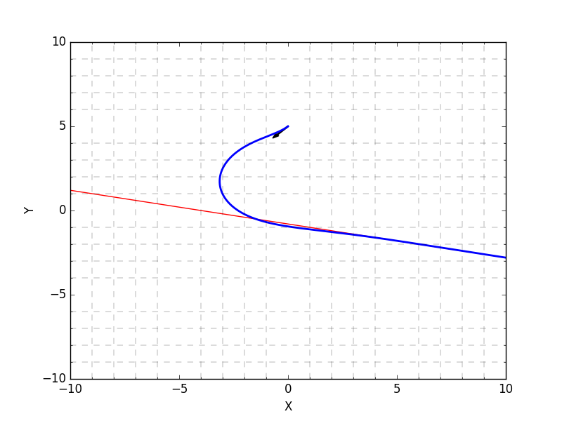

# Path tracking - Line following

Implementation of a line following algorithm proposed in P. I. Corke, "Robotics, Vision & Control", page 104. 


## Context

The goal is to follow a line from a random initial position and orientation. 
Both steering and speed and controlled, using two proportional controllers. 


The vehicle model used is a simple kinematic bicycle model.


## Some results

  


## Usage

```python
cd path_tracking/
python main_line_following.py
```

The ```main_line_following.py``` script is where you can modify the tests launched.


## References
1. P. I. Corke, "Robotics, Vision & Control", Springer 2017, ISBN 978-3-319-54413-7

