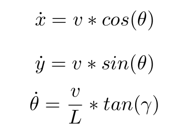
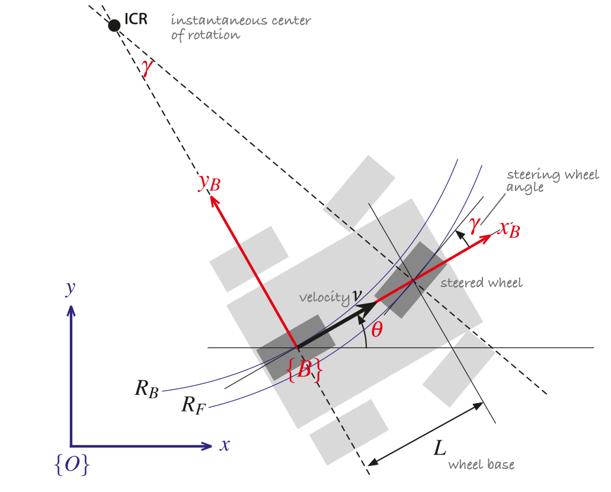
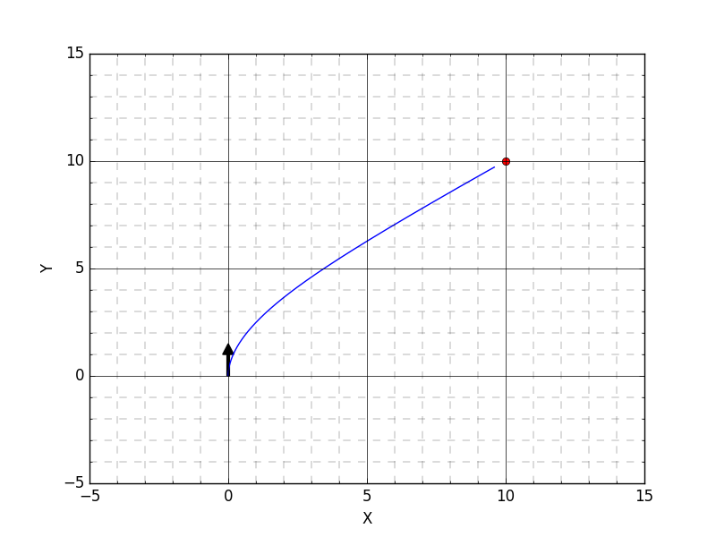
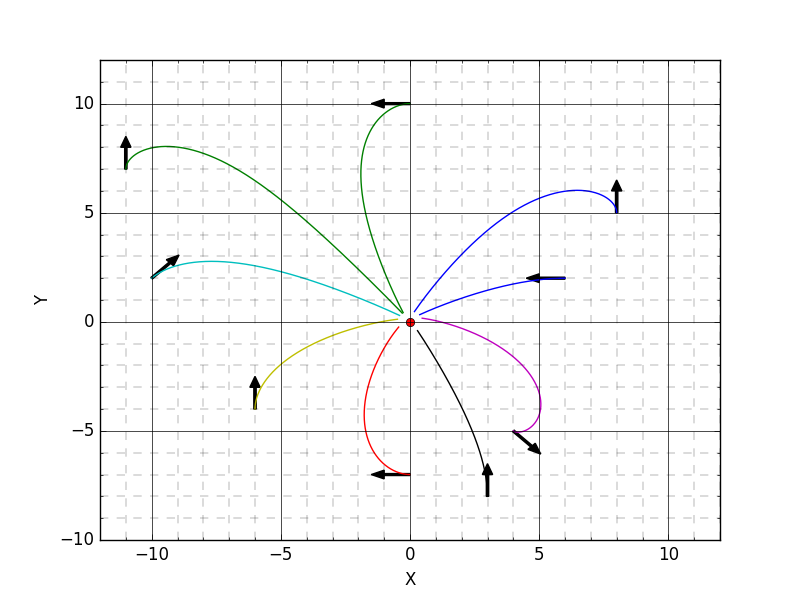

# Path tracking - Move to point

Implementation of a 'tracking' algorithm proposed in P. I. Corke, "Robotics, Vision & Control", page 102. 


## Context

The goal is to move toward a goal point (no goal orientation is defined) from an initial position and initial orientation. Both steering and speed and controlled, using two proportional controllers. 


The vehicle model used is a simple kinematic bicycle model. See below:




Source: P. I. Corke, "Robotics, Vision & Control", Springer 2017, ISBN 978-3-319-54413-7

## Some results

  



## Usage

```python
cd path_tracking/
python main_move2point.py
```

The ```main_move2point.py``` script is where you can modify the tests launched.


## References
1. P. I. Corke, "Robotics, Vision & Control", Springer 2017, ISBN 978-3-319-54413-7

