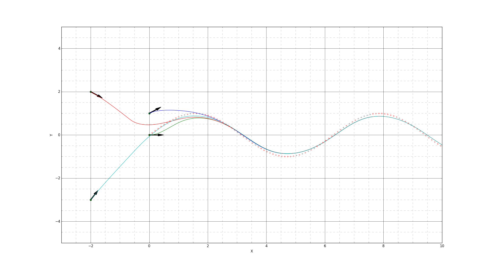

# Path tracking - trajectory following with Pure Pursuit

Implementation of a trajectory following algorithm proposed in P. I. Corke, "Robotics, Vision & Control", page 104.

Input:
- Initial robot's state.
- List of waypoints: List of objects of type Waypoint()

Output:
- Trajectory followed by the robot to follow the list of waypoints


## Context

The goal is to follow a trajectory from a random initial position and orientation.
Both steering and speed and controlled, using two P (for steering) and  PI (for speed) controllers.


The vehicle model used is a simple kinematic bicycle model.


## Some results

  


## Usage

```python
cd path_tracking/
python main_trajectory_following.py
```

The ```main_trajectory_following.py``` script is where you can modify the tests launched.

## Future improvements

- Better way to generate waypoints
- Change the function to find target waypoint - need something smoother (for speed)


## References
1. P. I. Corke, "Robotics, Vision & Control", Springer 2017, ISBN 978-3-319-54413-7
2. B. Paden, M. C ́ap, S. Z. Yong, D. S. Yershov, and E. Frazzoli.  A survey of motion planning and controltechniques for self-driving urban vehicles.IEEE Transactions on Intelligent Vehicles, 1(1), 2016.
3. H. Ohta, N. Akai, E. Takeuchi, S. Kato, and M. Edahiro, “Purepursuit revisited: Field testing of autonomous vehicles in urbanareas,” inProceedings of the 4th IEEE International Conferenceon Cyber-Physical Systems, Networks, and Applications, CPSNA2016, pp. 7–12, Japan, October 2016.
4. Martin  Lundgren,  “Path  Tracking  For  A  Miniature  Robot”,  Masters,  Department of Computer Science, University of Umea, 2003.
